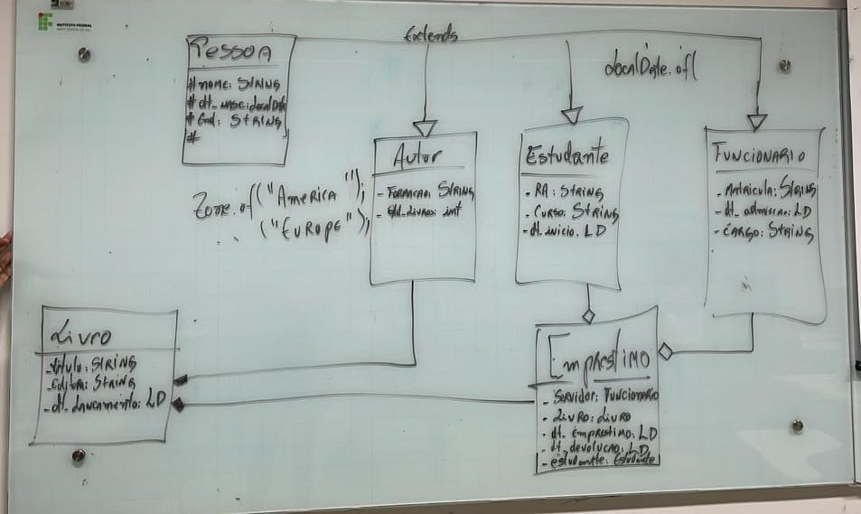

1. A ideia é fazer um menu de cadastro para uma livraria em que estudantes realizam empréstimo de livros

//----------------------------------Observação-------------------------------------//
Como nas aulas eu apenas rascunho o que vejo no quadro sendo exibido, para mostrar ao professor que não estou apenas  bancando o espertinho com base nos commits já upados em seu repositório, irei adicionar mais atributos em cada classe com informações pertinentes a herança;
//--------------------------------------------------------------------------------//

As classes que esse sistema deve possuir e seus respectivos atributos são:

- Pessoa: nome, data de nascimento, endereço, cpf, numero de telefone, devedor;
- Autor: formação, quantidade de livros;
- Estudante: RA (Identificação), curso, dt inicio, data prevista de termino;
- Funcionario: Matricula (id), data de admissão, cargo;
- Livro: Titulo, editora, dt de lançamento;
- Empréstimo: servidor, qual o livro, dt do emprestimo, dt de devolução, estudante

A Hierarquia do projeto é a seguinte: 

//----Por motivos óbvios, ignorar marcações no quadro que não correspondam ao conceito de herança----//
